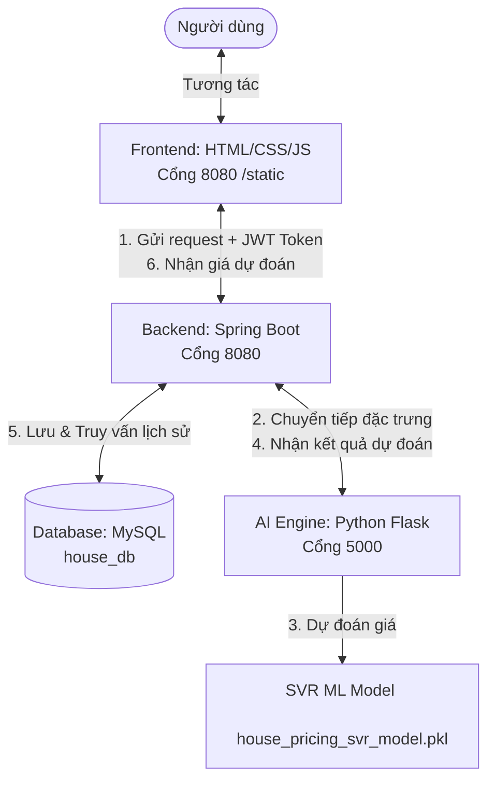

# 🏠 House Price Predictor (House AI)

Ứng dụng **Dự đoán giá nhà tại Việt Nam** dựa trên công nghệ học máy (Machine Learning) kết hợp với kiến trúc hệ thống lai (Hybrid Architecture) hiện đại. 

Hệ thống cho phép người dùng đăng ký, đăng nhập bảo mật, nhập các thông số thực tế của căn nhà (Diện tích, số tầng, số phòng ngủ, vị trí, loại hình, pháp lý) để nhận kết quả định giá tham khảo tức thì từ mô hình trí tuệ nhân tạo, đồng thời tự động lưu trữ và quản lý lịch sử dự đoán.

---

## 🗺️ Kiến Trúc Hệ Thống

Dự án áp dụng mô hình kiến trúc lai 3 tầng độc lập, giao tiếp với nhau qua giao thức **HTTP RESTful API**:



### ⚡ Luồng Hoạt Động
1. **Frontend**: Người dùng nhập thông tin nhà và nhấn **Dự đoán**. Yêu cầu kèm theo mã bảo mật **JWT Token** được gửi tới Spring Boot.
2. **Backend (Spring Boot)**: Nhận yêu cầu, kiểm tra token xác thực. Nếu hợp lệ, Spring Boot đóng vai trò làm Gateway sử dụng `RestTemplate` chuyển tiếp các đặc trưng số hóa sang Python Flask ở cổng `5000`.
3. **AI Engine (Python Flask)**:
   * Số hóa các trường chữ (Thành phố, Quận, Loại nhà, Pháp lý) bằng các bộ LabelEncoder được huấn luyện sẵn (`encoder_*.pkl`).
   * Chuẩn hóa dữ liệu qua `scaler.pkl`.
   * Đưa vector đặc trưng vào mô hình **SVR (Support Vector Regression)** để tính toán giá trị `log(price)`, sau đó dùng hàm mũ `np.exp` để quy đổi lại giá tiền gốc (triệu VNĐ) và trả kết quả về Spring Boot.
4. **Cơ sở dữ liệu (MySQL)**: Spring Boot nhận giá trị dự đoán, tự động lưu bản ghi lịch sử vào bảng `prediction_history` gắn liền với username, sau đó trả kết quả về Frontend hiển thị cho người dùng.

---

## 🛠️ Công Nghệ Sử Dụng

### 1. Backend Core (Java)
*   **Spring Boot 3.x**: Framework chính phát triển API.
*   **Spring Security**: Bảo mật hệ thống.
*   **JSON Web Token (JWT)**: Cơ chế xác thực phân quyền không lưu trạng thái (Stateless Authentication).
*   **Spring Data JPA / Hibernate**: Quản lý truy xuất và tự động tạo cấu trúc bảng cơ sở dữ liệu.
*   **MySQL Driver**: Kết nối cơ sở dữ liệu MySQL.

### 2. AI Engine & Machine Learning (Python)
*   **Python 3.x**
*   **Flask**: Micro-framework xây dựng API dự đoán gọn nhẹ.
*   **Scikit-Learn**: Tiền xử lý dữ liệu và chạy mô hình hồi quy SVR.
*   **Joblib**: Tải các mô hình và bộ tiền xử lý đã đóng gói (`.pkl`).
*   **Numpy**: Xử lý toán học dữ liệu mảng.

### 3. Frontend (Web Client)
*   **HTML5 & CSS3**: Giao diện thiết kế theo phong cách tối giản hiện đại (Warm Sand & Mineralist Minimalist Aesthetics), đáp ứng tốt trên các thiết bị.
*   **Vanilla Javascript**: Xử lý logic phía máy khách (gọi API bằng `fetch`, quản lý Token qua `localStorage`, cập nhật dữ liệu DOM động).

---

## 🚀 Hướng Dẫn Cài Đặt & Khởi Chạy

Hãy làm theo các bước hướng dẫn chi tiết dưới đây để cài đặt và khởi chạy dự án trên môi trường Local:

### Bước 1: Thiết Lập Cơ Sở Dữ Liệu MySQL
1. Khởi động MySQL Server của bạn (qua XAMPP, Laragon, MySQL Workbench hoặc Docker).
2. Tạo một cơ sở dữ liệu trống tên là `house_db` thông qua lệnh SQL:
   ```sql
   CREATE DATABASE house_db CHARACTER SET utf8mb4 COLLATE utf8mb4_unicode_ci;
   ```
3. Mở file cấu hình database của Spring Boot tại:
   `src/main/resources/application.properties`
4. Chỉnh sửa thông tin tài khoản MySQL của bạn:
   ```properties
   spring.datasource.url=jdbc:mysql://localhost:3306/house_db?useSSL=false&allowPublicKeyRetrieval=true&serverTimezone=UTC
   spring.datasource.username=TÊN_ĐĂNG_NHẬP_CỦA_BẠN (Thường là root)
   spring.datasource.password=MẬT_KHẨU_CSDL_CỦA_BẠN
   ```
   *(Lưu ý: Bạn không cần nạp file SQL nào cả. Khi Spring Boot khởi chạy, Hibernate sẽ tự động tạo các bảng `users` và `prediction_history` nhờ dòng lệnh `spring.jpa.hibernate.ddl-auto=update`).*

### Bước 2: Chạy AI Engine (Python Flask)
Dự án đã được tích hợp sẵn một môi trường ảo Python `.venv` ở thư mục dự án con `TTCS/TTCS-main/TTCS`.

1. Mở một cửa sổ Terminal mới trong IDE của bạn.
2. Di chuyển vào thư mục code:
   ```powershell
   cd TTCS/TTCS-main/TTCS
   ```
3. Kích hoạt môi trường ảo Python:
   *   **Trên Windows (PowerShell):**
       ```powershell
       .\.venv\Scripts\activate
       ```
   *   **Trên macOS/Linux:**
       ```bash
       source .venv/bin/activate
       ```
4. Cài đặt các thư viện cần thiết để chạy model:
   ```powershell
   pip install flask joblib numpy scikit-learn
   ```
5. Chạy ứng dụng Python Flask:
   ```powershell
   python app.py
   ```
   *Khi xuất hiện thông báo `* Running on http://127.0.0.1:5000`, dịch vụ AI đã sẵn sàng hoạt động ở cổng 5000.*

### Bước 3: Chạy Backend (Spring Boot)
1. Mở một cửa sổ Terminal thứ hai.
2. Di chuyển vào thư mục code chứa file `mvnw`:
   ```powershell
   cd TTCS/TTCS-main/TTCS
   ```
3. Khởi chạy ứng dụng Spring Boot:
   *   **Trên Windows:**
       ```powershell
       .\mvnw spring-boot:run
       ```
   *   **Trên macOS/Linux:**
       ```bash
       ./mvnw spring-boot:run
       ```
   *Đợi đến khi màn hình log của Spring Boot hoàn tất khởi động và sẵn sàng ở cổng `8080`.*

### Bước 4: Truy Cập Trải Nghiệm Giao Diện
1. Mở trình duyệt web bất kỳ.
2. Truy cập vào trang đăng nhập của hệ thống:
   **[http://localhost:8080/login.html](http://localhost:8080/login.html)**
3. Nếu chưa có tài khoản, bấm chọn **Đăng ký** để tạo tài khoản mới.
4. Đăng nhập để tự động chuyển hướng sang trang chủ **index.html**.
5. Nhập thông tin chi tiết căn nhà của bạn và nhấn **Dự đoán giá nhà** để nhận kết quả định giá!
6. Click vào tab **📊 Lịch sử** trên thanh điều hướng để xem lại danh sách, lọc tìm kiếm hoặc xóa các lần định giá trước đó.

---

> [!WARNING]
> **Một Số Lưu Ý Quan Trọng:**
> 1. **Cảnh báo phiên bản (InconsistentVersionWarning):** Khi chạy `python app.py`, bạn có thể thấy một số cảnh báo phiên bản thư viện Scikit-learn khác nhau giữa môi trường huấn luyện mô hình và chạy thực tế. Điều này là hoàn toàn bình thường và không ảnh hưởng đến độ chính xác của dự đoán.
> 2. **Lỗi 404 khi truy cập Flask:** Nếu truy cập trực tiếp `http://localhost:5000/` trên trình duyệt bạn sẽ nhận mã `404 Not Found`. Đây là thiết kế chuẩn vì Flask chỉ cung cấp duy nhất endpoint POST `/predict` cho Spring Boot gọi nội bộ, không hỗ trợ giao diện web trên cổng 5000.